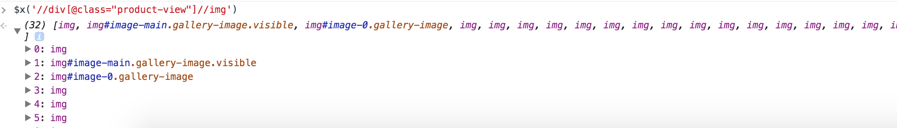

# how-to-extract

The following instructions will use Chrome to explore and extract xpath from a webpage.

## Instrcution

You want to extract all useful information on the page using reliable xpath queries.
This document is showing you how to do it using the best practices.

## end result:

what we want is a spreadsheet with the name of the website on top.
First column will be the name of the extracted information (eg. title, decription, prices)
Second column will be the position of the element using Xpath

THIS IS A COMPLEX EXAMPLE. 
YOU DO NOT HAVE TO HAVE THAT MANY ATTRIBUTES.
THERE IS NO SPECIFICATION REGARDING THE NAME YOU CHOOSE FOR THE ATTRIBUTES (whatever make sense to you)

For instance this spreadsheet


## Chrome Inspect Feature

Lets select the title and right click -> Inspect:


This will open the chrome console and automaticaly select the html tag corresponding to the selected element:


The console is allowing you to write some instruction to test your xpath.
To do that you have to use the helper: `$x('//my_xpath')`
The following screenshot is showing who to select the title text using xpath

This is a snippet of the page:
```html
<div class="product-view" itemscope="" itemtype="https://schema.org/Product">
...
    <div class="product-name">
        <h1 itemprop="name"> Maxi Cosi Euro NXT Isofix Car Seat - Gravity</h1>
        <span class="product-sku">
        <span class="label">Product Code</span>
        #101267 </span>
    </div>
...
</div>
```

You can use the xpath: `//div[@class="product-view"]` to restrain the xpath to only what is inside the job desctription.
(Notice the breadcrumb that is outside the `div.product-view` will need to be extracted as well)


Now we can start to test the xpath to extract the title within the console using the  `$x('//my_xpath')` helper


### title 

We are seeing that `$x('//div[@class="product-view"]//h1')` is returning 1 element.
and `$x('//div[@class="product-view"]//h1/text()')` will return one text 

You can go one more step and displaying the value of this extracted object using the javascript code `.forEach(a => console.log(a))`


Now that our xpath is defined we can save the result in a spreadsheet as such:
(Note specifying the website at the top, the left column is a name to identify what is the field about and another column to save the actual xpath query):


### prices
We want all the prices in the page so we will target the englobing `div.price-box`  


From there, we try to extract only the price by targeting texts with the $ sign.
The problem is that the assessories and the related products also have the class `div.price-box` which means that our xpqth query is too broad with 15 hits.


Targeting the `div.price-info` will solve the problem with only 1 hit.


This xpath uses the `span[contains(text(), "$")]` to target texts that contains the $ sign.

`//div[@class="product-view"]//div[@class="price-info"]//span[contains(text(), "$")]/text()`

As you can see, we can retreibe $649 and $438.
(Note we use the javasript: `.forEach(a => console.log(a))` to display the text matched by the xpath)


### images

Simply trying to get all the images under `div.product-view` will return too many images with 32 images.



Now there is only one `img.image-main` so we can easily get this one with `//img[@id="image-main"]/@src`


The other ones are more difficult because we could have many of them.
Getting all the image @src under `ul.product-image-thumbs` seems like a good choice: `//ul[@class="product-image-thumbs"]//img/@src` 


### the brand name and the brand image

On this page we can retreive information about the brand name and image using the `div.pull-right` section.
In this case we are using a css that is for formating only but this is an edge case. YOU SHOULD ALWAYS AVOID USING STYLING CSS TO TARGET FIELDS.


Title and img@src
```
//div[@class="product-view"]//div[@class="pull-right"]//p[contains(@class, "brands-image")]//img/@title
//div[@class="product-view"]//div[@class="pull-right"]//p[contains(@class, "brands-image")]//img/@src
```

##### Debugging example

On the following screenshot you see that I had 0 result with the top query. I decided to remove one of the constraint to see if a result was found. I slowly rebuild the query fixing what was originaly wrong.


### short description

`'//div[contains(@class, "short-description")]//text()`


For some reason the description get 2 hits. One for the desktop view and one for the mobile view


In that case I can specify FIRST on the spreadsheet


### suitable for 

Again in that case we need to retreive element 1 and 2 and it is very deficult otherwise.


We can specify 1,2 in the spreadsheet


### description with many tabs

Usualy a website will have many tabs but the data will still be on the page. 
In this case the data is under `dl.collateral-tabs`


All tabs desciption are very similar the only changing attribute is the `h2/text()` attribute


So to retreive the Feature tab we can do:
`//*[@id="collateral-tabs"]//h2[contains(text(), "Features")]/following-sibling::*//text()`
This query mean: Under `#collateral-tab` get the h2 with text `Features` and return the `following-sibling::*//text()`
We see 29 hits

using `.forEach(a => console.log(a))` we see that the hits are all OK so this is the right xpath


Detail will be very similar with `Features` becoming `Details`:
`//*[@id="collateral-tabs"]//h2[contains(text(), "Details")]/following-sibling::*//text()`


Same for `Specifications` `Additional Info` and `Reviews`

## Broadly crawl many data:

### breadcrumb example


`$x('//*[contains(@class, "breadcrumbs")]//text()')`
Will return 31 text object but most of them are '\n'

```
$x('//*[contains(@class, "breadcrumbs")]//text()').reduce((acc, v) => acc.concat(v.data), [])

```
will result in:
`(31) ["↵", "↵", "↵", "↵", " ", "↵", "↵", "↵", "↵", "↵", "↵", "↵Car Seats ", "↵", "↵", "↵", "↵", "↵", "↵", "↵Convertibles ", "↵", "↵", "↵", "↵", "↵", "↵", "Maxi Cosi Euro NXT Isofix Car Seat - Gravity", "↵", "Maxi Cosi Euro NXT Isofix Car Seat - Gravity", "↵", "↵", "↵"]`

This kind of output is fine in our case because all the important information has been captured and the remaining infomation is just: `"↵", " "`

### up sell 
Interesting information on a page will inculde the related product and accessories.
Here we see the `div.box-up-sell` 


In this case we will not extract all the info individually but we will extract arrays with all the products info.
For instance we will extract an array of the 8 elements titles, 8 elements img/@src, 8 elements prices, etc...

Let see how to do that:
targeting `div.item` will return 10 elements instead of 8 in that case
Lets examine the query:


`//div[contains(@class, "box-up-sell")]//div[contains(@class, "item")]`
First line we see that `div.carousel.multiple-items` was a match for our query that match every div containing 'item'

lets exclude those divs using `and not(contains(@class, "multiple-item"))` 

such as the new query to get the 8 links:
`//div[contains(@class, "box-up-sell")]//div[contains(@class, "item") and not(contains(@class, "multiple-item"))]//div[@class="product-name"]/a`


Getting the 8 titles is not that different

`//div[contains(@class, "box-up-sell")]//div[contains(@class, "item") and not(contains(@class, "multiple-item"))]//div[@class="product-name"]/a/text()`

Product image was having 16 hits because of the brand images so the query needed to target another div


prices:


Brand image src and title:


### related products 


Related product is different than up sale so we extract them in different variables but very similar xpath:


### the result:


